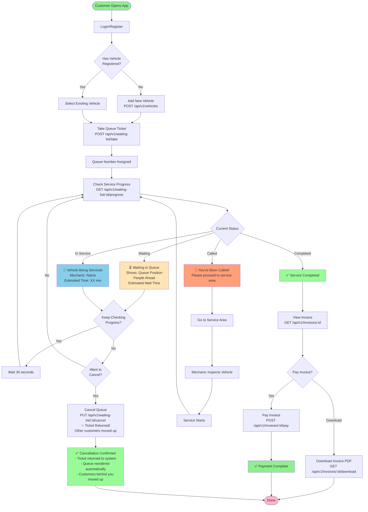
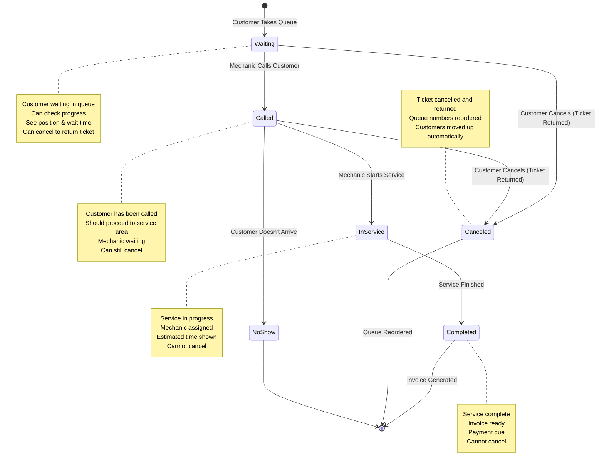
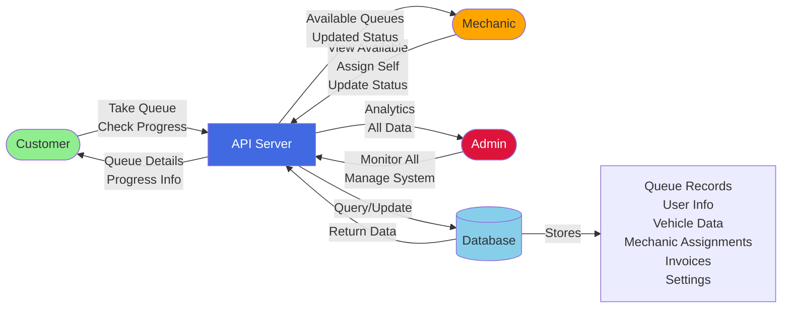

# System Flowcharts - Queue Management System

This document contains flowcharts for all user roles in the Queue Management System.

## Customer Workflow

## Mechanic Workflow

```mermaid
flowchart TD
    Start([Mechanic Starts Shift]) --> Login[Login with Mechanic Account]
    Login --> Dashboard[View Dashboard]
    
    Dashboard --> ViewAvailable[View Available Queues<br/>GET /api/v1/mechanic/waiting-list/available]
    
    ViewAvailable --> QueueList[Shows List of Waiting Customers:<br/>- Customer Name & Phone<br/>- Vehicle Details<br/>- Service Type<br/>- Queue Number<br/>- Customer Notes]
    
    QueueList --> ChooseCustomer{Choose Which<br/>Customer to<br/>Service?}
    
    ChooseCustomer -->|Priority/Urgent| AssignSelf[Assign Self to Queue<br/>POST /api/v1/mechanic/waiting-list/assign]
    ChooseCustomer -->|Next in Line| AssignSelf
    ChooseCustomer -->|Specific Expertise| AssignSelf
    
    AssignSelf --> AssignSuccess[✅ Assigned as Mechanic<br/>Your name now visible to customer]
    
    AssignSuccess --> CallCustomer[Call Customer<br/>PUT /api/v1/mechanic/waiting-list/:id/call]
    
    CallCustomer --> CustomerArrives{Customer<br/>Arrives?}
    
    CustomerArrives -->|Yes| InspectVehicle[Inspect Vehicle]
    CustomerArrives -->|No| WaitForCustomer[Wait 5-10 minutes]
    
    WaitForCustomer --> StillNoShow{Still No Show?}
    StillNoShow -->|Yes| MarkNoShow[Mark as No-Show<br/>PUT /api/v1/mechanic/waiting-list/:id/no-show]
    StillNoShow -->|No| InspectVehicle
    
    InspectVehicle --> AddNotes[Add Inspection Notes & Estimate<br/>PUT /api/v1/mechanic/waiting-list/:id<br/>- estimated_time<br/>- mechanic_notes]
    
    AddNotes --> StartService[Start Service<br/>PUT /api/v1/mechanic/waiting-list/:id/start]
    
    StartService --> PerformService[🔧 Perform Service Work]
    
    PerformService --> CheckComplete{Service<br/>Complete?}
    
    CheckComplete -->|No| PerformService
    CheckComplete -->|Yes| CompleteService[Complete Service<br/>PUT /api/v1/mechanic/waiting-list/:id/complete]
    
    CompleteService --> CreateInvoice{Need to<br/>Create Invoice?}
    
    CreateInvoice -->|Yes| GenerateInvoice[Generate Invoice<br/>POST /api/v1/admin/invoices]
    CreateInvoice -->|No| NextCustomer
    
    GenerateInvoice --> NextCustomer{Service Next<br/>Customer?}
    
    NextCustomer -->|Yes| ViewAvailable
    NextCustomer -->|No| EndShift[End Shift]
    
    MarkNoShow --> NextCustomer
    EndShift --> End([Done])
    
    style Start fill:#90EE90
    style End fill:#FFB6C1
    style AssignSuccess fill:#98FB98
    style InspectVehicle fill:#87CEEB
    style PerformService fill:#DDA0DD
    style CompleteService fill:#98FB98
    style MarkNoShow fill:#FFA07A
```

## Admin Workflow

```mermaid
flowchart TD
    Start([Admin Opens Dashboard]) --> Login[Login with Admin Account]
    Login --> AdminDashboard[Admin Dashboard]
    
    AdminDashboard --> ChooseAction{Select Action}
    
    ChooseAction -->|Monitor Queues| MonitorQueues[View All Service Progress<br/>GET /api/v1/mechanic/waiting-list/progress/all]
    ChooseAction -->|Manage Users| ManageUsers[Manage Users & Roles]
    ChooseAction -->|View Analytics| ViewAnalytics[View Analytics Dashboard]
    ChooseAction -->|Manage Settings| ManageSettings[Manage System Settings]
    ChooseAction -->|Manage Invoices| ManageInvoices[Manage Invoices]
    
    MonitorQueues --> QueueOverview[Shows All Queues:<br/>- Queue Number<br/>- Customer Details<br/>- Mechanic Assigned<br/>- Status<br/>- Vehicle Info<br/>- Timestamps]
    
    QueueOverview --> QueueAction{Need to Take<br/>Action?}
    
    QueueAction -->|Call Customer| CallCustomerAdmin[Call Customer<br/>PUT /api/v1/mechanic/waiting-list/:id/call]
    QueueAction -->|Update Notes| UpdateQueue[Update Queue Details<br/>PUT /api/v1/mechanic/waiting-list/:id]
    QueueAction -->|Start Service| StartServiceAdmin[Start Service<br/>PUT /api/v1/mechanic/waiting-list/:id/start]
    QueueAction -->|Complete Service| CompleteServiceAdmin[Complete Service<br/>PUT /api/v1/mechanic/waiting-list/:id/complete]
    QueueAction -->|Mark No-Show| MarkNoShowAdmin[Mark No-Show<br/>PUT /api/v1/mechanic/waiting-list/:id/no-show]
    QueueAction -->|View Details| ViewDetails[View Full Queue Details]
    
    CallCustomerAdmin --> MonitorQueues
    UpdateQueue --> MonitorQueues
    StartServiceAdmin --> MonitorQueues
    CompleteServiceAdmin --> MonitorQueues
    MarkNoShowAdmin --> MonitorQueues
    ViewDetails --> MonitorQueues
    
    ManageUsers --> UserActions{User Action}
    UserActions -->|View All Users| GetUsers[GET /api/v1/admin/users]
    UserActions -->|Create User| CreateUser[POST /api/v1/admin/users]
    UserActions -->|Update User| UpdateUser[PUT /api/v1/admin/users/:id]
    UserActions -->|Delete User| DeleteUser[DELETE /api/v1/admin/users/:id]
    UserActions -->|Assign Role| AssignRole[POST /api/v1/admin/users/:id/roles]
    UserActions -->|View Roles| ViewRoles[GET /api/v1/admin/roles]
    
    GetUsers --> AdminDashboard
    CreateUser --> AdminDashboard
    UpdateUser --> AdminDashboard
    DeleteUser --> AdminDashboard
    AssignRole --> AdminDashboard
    ViewRoles --> AdminDashboard
    
    ViewAnalytics --> AnalyticsOptions{Analytics Type}
    AnalyticsOptions -->|Overview| GetOverview[GET /api/v1/admin/analytics/overview]
    AnalyticsOptions -->|Revenue Stats| GetRevenue[GET /api/v1/admin/analytics/revenue-stats]
    AnalyticsOptions -->|Service Stats| GetService[GET /api/v1/admin/analytics/service-stats]
    AnalyticsOptions -->|Queue Stats| GetQueueStats[GET /api/v1/admin/analytics/queue-stats]
    AnalyticsOptions -->|Mechanic Performance| GetMechanicPerf[GET /api/v1/admin/analytics/mechanic-performance]
    
    GetOverview --> AnalyticsView[View Analytics Dashboard]
    GetRevenue --> AnalyticsView
    GetService --> AnalyticsView
    GetQueueStats --> AnalyticsView
    GetMechanicPerf --> AnalyticsView
    
    AnalyticsView --> AdminDashboard
    
    ManageSettings --> SettingsActions{Settings Action}
    SettingsActions -->|View Settings| GetSettings[GET /api/v1/admin/settings]
    SettingsActions -->|Update Setting| UpdateSetting[PUT /api/v1/admin/settings/key/:key]
    SettingsActions -->|Max Daily Tickets| UpdateMaxTickets[Update max_tickets_per_day]
    SettingsActions -->|Business Hours| UpdateHours[Update business_hours]
    
    GetSettings --> AdminDashboard
    UpdateSetting --> AdminDashboard
    UpdateMaxTickets --> AdminDashboard
    UpdateHours --> AdminDashboard
    
    ManageInvoices --> InvoiceActions{Invoice Action}
    InvoiceActions -->|View All| GetInvoices[GET /api/v1/admin/invoices]
    InvoiceActions -->|Create Invoice| CreateInvoice[POST /api/v1/admin/invoices]
    InvoiceActions -->|Update Invoice| UpdateInvoice[PUT /api/v1/admin/invoices/:id]
    InvoiceActions -->|Delete Invoice| DeleteInvoice[DELETE /api/v1/admin/invoices/:id]
    InvoiceActions -->|View Details| GetInvoiceDetail[GET /api/v1/admin/invoices/:id]
    
    GetInvoices --> AdminDashboard
    CreateInvoice --> AdminDashboard
    UpdateInvoice --> AdminDashboard
    DeleteInvoice --> AdminDashboard
    GetInvoiceDetail --> AdminDashboard
    
    QueueAction -->|Back to Dashboard| AdminDashboard
    AdminDashboard -->|Logout| End([Logout])
    
    style Start fill:#90EE90
    style End fill:#FFB6C1
    style AdminDashboard fill:#87CEEB
    style MonitorQueues fill:#DDA0DD
    style ViewAnalytics fill:#F0E68C
    style ManageUsers fill:#FFB6C1
    style ManageSettings fill:#98FB98
    style ManageInvoices fill:#FFA07A
```

## System Overview - All Roles

```mermaid
flowchart TD
    System([Queue Management System])
    
    System --> Customer[👤 Customer]
    System --> Mechanic[🔧 Mechanic]
    System --> Admin[👨‍💼 Admin]
    
    Customer --> C1[Register/Login]
    Customer --> C2[Add/Select Vehicle]
    Customer --> C3[Take Queue Ticket]
    Customer --> C4[Check Progress]
    Customer --> C5[View Mechanic Name]
    Customer --> C6[Pay Invoice]
    
    Mechanic --> M1[View Available Queues]
    Mechanic --> M2[Assign Self to Queue]
    Mechanic --> M3[Call Customer]
    Mechanic --> M4[Inspect & Add Notes]
    Mechanic --> M5[Start Service]
    Mechanic --> M6[Complete Service]
    Mechanic --> M7[Add Maintenance Items]
    
    Admin --> A1[Monitor All Queues]
    Admin --> A2[View Mechanic Assignments]
    Admin --> A3[Manage Users & Roles]
    Admin --> A4[View Analytics]
    Admin --> A5[Manage Settings]
    Admin --> A6[Manage Invoices]
    Admin --> A7[Override Queue Actions]
    
    C3 --> Queue[(Queue Database)]
    M2 --> Queue
    A1 --> Queue
    
    M6 --> Invoice[(Invoice Database)]
    C6 --> Invoice
    A6 --> Invoice
    
    style System fill:#4169E1,color:#fff
    style Customer fill:#90EE90
    style Mechanic fill:#FFA500
    style Admin fill:#DC143C,color:#fff
    style Queue fill:#87CEEB
    style Invoice fill:#FFB6C1
```

## Queue Status Flow

## Data Flow Diagram

---

## Legend

### Status Colors
- 🟢 **Green**: Success/Completed states
- 🔵 **Blue**: Active/In-progress states
- 🟡 **Yellow**: Waiting/Pending states
- 🟠 **Orange**: Warning/Attention needed
- 🔴 **Red**: Error/Canceled states

### Icons
- 👤 Customer
- 🔧 Mechanic
- 👨‍💼 Admin
- ⏳ Waiting
- 📢 Called
- 🔧 In Service
- ✅ Completed
- ❌ Canceled

### HTTP Methods
- **GET**: Retrieve data
- **POST**: Create new data
- **PUT**: Update existing data
- **DELETE**: Remove data

---

**Generated:** February 14, 2026  
**Version:** 1.1.0  
**System:** Queue Management with Mechanic Assignment  
**Latest Enhancement:** Cancel Ticket Returns Queue Slot - When a customer cancels their ticket, the slot is returned to the system and queue numbers are automatically reordered, moving other customers up in line.

