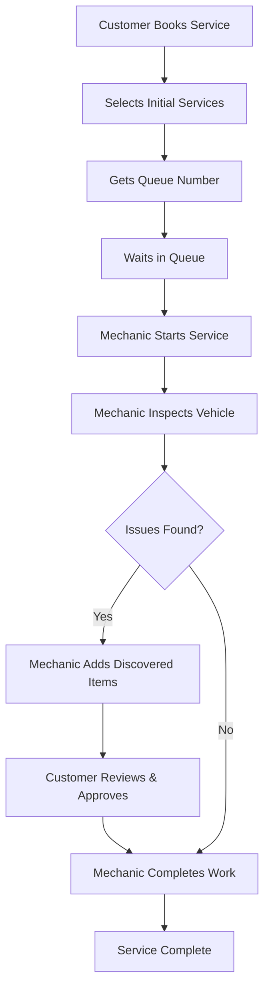

# 🚗 Car Maintenance Service API

A production-ready REST API built with **Clean Architecture** and **Domain-Driven Design** principles for managing car maintenance services with queue management, maintenance tracking, and complete customer service workflow.


## ✨ Features

- 🔐 **JWT Authentication** - Secure token-based authentication
- 👥 **Role-Based Access Control** - Admin, Mechanic, and Customer roles
- 🚙 **Vehicle Management** - Track customer vehicles and service history
- 📋 **Smart Queue System** - Automated ticket management with daily limits
- 🔧 **Maintenance Tracking** - Initial services + discovered issues workflow
- ✅ **Customer Approval Flow** - Customers approve additional work before proceeding
- ⏰ **Real-time Progress Tracking** - Customers see their queue position and wait time
- 🛡️ **Rate Limiting** - 100 requests/minute per IP
- 📊 **Request Tracing** - Unique ID for every request
- 🔒 **Production-Safe** - Error sanitization, SQL logging control
- 📅 **Automated Jobs** - Daily cleanup of old queue entries
- ⚙️ **Configurable Settings** - Dynamic shop configuration

## 📚 Documentation

- **[Quick Start Guide](QUICK_START.md)** - Get up and running in 5 minutes
- **[API Documentation](API_DOCUMENTATION.md)** - Complete API reference with examples
- **[Code Review & Analysis](CODE_REVIEW_ANALYSIS.md)** - Quality assessment and recommendations
- **[Implementation Summary](IMPLEMENTATION_SUMMARY.md)** - Recent improvements and fixes

## 🚀 Quick Start

```bash
# 1. Clone the repository
git clone https://github.com/yourusername/go-crud.git
cd go-crud

# 2. Install dependencies
go mod download

# 3. Configure environment (create .env file)
cp .env.example .env
# Edit .env with your database credentials

# 4. Build and run
go build -o api.exe ./cmd/api
./api.exe
```

Server will start on `http://localhost:8080`

See [QUICK_START.md](QUICK_START.md) for detailed instructions.

## 🏗️ Architecture

Built with **Clean Architecture** principles:

```
┌─────────────────────────────────────┐
│         HTTP Handlers               │  ← Adapters (Controllers)
├─────────────────────────────────────┤
│         Use Cases                   │  ← Application Business Rules
├─────────────────────────────────────┤
│    Domain (Entities & Services)     │  ← Enterprise Business Rules
├─────────────────────────────────────┤
│   Infrastructure (DB, Config, etc)  │  ← Frameworks & Drivers
└─────────────────────────────────────┘
```

### Key Design Patterns
- **Repository Pattern** - Data access abstraction
- **Dependency Injection** - Loose coupling
- **Middleware Chain** - Request/response processing
- **Clean Architecture** - Separation of concerns

## Project Structure

```
project-name/
├── cmd/
│   └── api/
│       └── main.go                 # Application entry point
├── internal/
│   ├── domain/                     # Business entities and rules
│   │   ├── entities/               # Core business entities
│   │   │   ├── user.go
│   │   │   ├── vehicle.go
│   │   │   ├── booking.go
│   │   │   ├── invoice.go
│   │   │   └── part.go
│   │   ├── repositories/           # Repository interfaces
│   │   │   ├── user_repository.go
│   │   │   ├── vehicle_repository.go
│   │   │   ├── booking_repository.go
│   │   │   └── inventory_repository.go
│   │   └── services/               # Domain service interfaces
│   │       ├── user_service.go
│   │       └── booking_service.go
│   ├── usecases/                   # Application business rules
│   │   ├── user_usecase.go
│   │   └── booking_usecase.go
│   ├── adapters/
│   │   ├── handlers/               # HTTP handlers (controllers)
│   │   │   ├── http/
│   │   │   │   ├── user_handler.go
│   │   │   │   ├── booking_handler.go
│   │   │   │   └── middleware/
│   │   │   │       ├── auth.go
│   │   │   │       ├── cors.go
│   │   │   │       └── logging.go
│   │   └── repositories/           # Repository implementations
│   │       └── mssql/
│   │           ├── user_repository.go
│   │           └── booking_repository.go
│   ├── infrastructure/             # Framework and drivers
│   │   ├── database/
│   │   │   └── mssql.go
│   │   ├── config/
│   │   │   └── config.go
│   │   ├── logger/
│   │   │   └── logger.go
│   │   └── server/
│   │       └── http.go
│   └── shared/                     # Shared utilities
│       ├── utils/                  # Utility functions
│       ├── dto/                    # Data Transfer Objects
│       ├── constants/              # Application constants
│       └── types/                  # Custom types
├── pkg/                            # Public libraries
│   └── response/                   # Response utilities
├── tests/                          # Integration tests
│   └── integration/
└── docs/                           # Documentation
    ├── API_DOCUMENTATION.md
    ├── CODE_REVIEW_ANALYSIS.md
    ├── IMPLEMENTATION_SUMMARY.md
    └── QUICK_START.md
```

## 🔑 Core Workflow

### Customer Service Flow



## 🔐 Security Features

- ✅ **JWT Authentication** with configurable expiration
- ✅ **Role-Based Access Control** (RBAC)
- ✅ **Rate Limiting** (100 req/min per IP)
- ✅ **Request Size Limits** (10MB max)
- ✅ **SQL Injection Protection** (parameterized queries)
- ✅ **Error Sanitization** (production mode)
- ✅ **CORS Support** with configurable origins
- ✅ **Request ID Tracing** for audit trails

## 🛠️ Tech Stack

| Component | Technology |
|-----------|-----------|
| Language | Go 1.21+ |
| Web Framework | Gorilla Mux |
| Database | Microsoft SQL Server |
| ORM | GORM |
| Authentication | JWT (golang-jwt) |
| Job Scheduler | gocron v2 |
| Configuration | godotenv |
| Logging | Custom logger (structured) |

## 📋 API Endpoints

### Authentication
- `POST /api/v1/auth/register` - Register new customer
- `POST /api/v1/auth/login` - Login and get JWT token
- `POST /api/v1/auth/refresh` - Refresh expired token

### Vehicle Management
- `GET /api/v1/vehicles` - List my vehicles
- `POST /api/v1/vehicles` - Add new vehicle
- `PUT /api/v1/vehicles/{id}` - Update vehicle
- `DELETE /api/v1/vehicles/{id}` - Remove vehicle

### Queue Management
- `POST /api/v1/waiting-list/take` - Book service and get queue number
- `GET /api/v1/waiting-list/my-queue` - View my queue entries
- `GET /api/v1/waiting-list/{id}/progress` - Check service progress
- `PUT /api/v1/waiting-list/{id}/cancel` - Cancel booking
- `GET /api/v1/waiting-list/availability` - Check available slots

### Maintenance Items
- `POST /api/v1/maintenance/waiting-list/{id}/items` - Add initial services
- `GET /api/v1/maintenance/waiting-list/{id}/items` - List all items
- `GET /api/v1/maintenance/waiting-list/{id}/inspection-summary` - Get inspection details
- `POST /api/v1/maintenance/items/approve` - Approve/reject discovered items

### Admin Operations
- `PUT /api/v1/admin/waiting-list/{id}/call` - Call next customer
- `PUT /api/v1/admin/waiting-list/{id}/start` - Start service
- `PUT /api/v1/admin/waiting-list/{id}/complete` - Complete service
- `POST /api/v1/admin/maintenance/items/discovered` - Add discovered issue

**[See full API documentation →](API_DOCUMENTATION.md)**

## 🧪 Testing

```bash
# Run unit tests
go test ./...

# Run with coverage
go test -cover ./...

# Run specific test
go test ./internal/usecases -v
```

## 📦 Deployment

### Docker

```bash
# Build image
docker build -t car-maintenance-api .

# Run container
docker run -p 8080:8080 --env-file .env car-maintenance-api
```

### Docker Compose

```bash
# Start all services (API + Database)
docker-compose up -d

# View logs
docker-compose logs -f

# Stop services
docker-compose down
```

### Manual Deployment

```bash
# Build for production
GIN_MODE=release go build -o api ./cmd/api

# Run
./api
```

## ⚙️ Configuration

Environment variables (`.env` file):

```env
# Server
PORT=8080
GIN_MODE=debug                    # or 'release' for production

# Database
DB_HOST=localhost
DB_PORT=1433
DB_USER=sa
DB_PASSWORD=YourPassword
DB_DATABASE=car_maintenance_db

# JWT
JWT_SECRET=your-secret-key-here
JWT_EXPIRATION=24                 # hours

# Optional
RAILWAY_ENVIRONMENT=production    # Enables production mode
```

## 📊 Monitoring & Observability

### Request Tracing
Every request gets a unique ID in the `X-Request-ID` header for tracing across logs.

### Logging
- **Development:** All requests logged with full details
- **Production:** Only errors and slow requests (>1s) logged
- All logs include Request ID for correlation

### Health Check
```bash
curl http://localhost:8080/health
```

## 🔄 Background Jobs

### Daily Cleanup Job
- **Schedule:** Every day at midnight (configurable)
- **Function:** Removes old completed/canceled queue entries
- **Retention:** 7 days (configurable via settings)
- **Control:** Can be enabled/disabled via database settings

## 🤝 Contributing

1. Fork the repository
2. Create your feature branch (`git checkout -b feature/amazing-feature`)
3. Commit your changes (`git commit -m 'Add amazing feature'`)
4. Push to the branch (`git push origin feature/amazing-feature`)
5. Open a Pull Request

### Code Style
- Follow Go conventions and best practices
- Run `go fmt` before committing
- Add tests for new features
- Update documentation

## 📝 License

This project is licensed under the MIT License - see the LICENSE file for details.

## 👥 Authors

- **Your Name** - Initial work

## 🙏 Acknowledgments

- Clean Architecture by Robert C. Martin
- Domain-Driven Design principles
- Go community for excellent packages

## 📮 Support

For bugs and feature requests, please create an issue on GitHub.

For questions and discussions, please use GitHub Discussions.

---

**Built with ❤️ using Go and Clean Architecture principles**

- **Clean Architecture**: Follows Uncle Bob's Clean Architecture principles
- **UUID Primary Keys**: All entities use UUID with SQL Server `uniqueidentifier` type
- **JWT Authentication**: Secure authentication with role-based access control
- **Repository Pattern**: Interface-based repository pattern for data access
- **Dependency Injection**: Proper dependency injection throughout the application
- **Middleware Support**: CORS, logging, authentication middleware
- **Docker Support**: Full Docker and Docker Compose support

## UUID Implementation

All models now use UUID with the following pattern:

```go
type Entity struct {
    ID        uuid.UUID      `gorm:"type:uniqueidentifier;primary_key;default:newid()" json:"id"`
    CreatedAt time.Time      `json:"created_at"`
    UpdatedAt time.Time      `json:"updated_at"`
    DeletedAt gorm.DeletedAt `gorm:"index" json:"-"`
    // ... other fields
}

func (e *Entity) BeforeCreate(tx *gorm.DB) error {
    if e.ID == uuid.Nil {
        e.ID = uuid.New()
    }
    return nil
}
```

## Getting Started

### Prerequisites

- Go 1.21+
- SQL Server (or Docker)
- Redis (optional, for caching)

### Installation

1. Clone the repository:
```bash
git clone <repository-url>
cd go-crud
```

2. Copy environment variables:
```bash
cp .env.example .env
```

3. Update the `.env` file with your database and other configurations.

4. Install dependencies:
```bash
make deps
```

5. Run database migrations:
```bash
make migrate
```

6. Build and run the application:
```bash
make build
make run
```

### Using Docker

1. Start with Docker Compose:
```bash
make docker-run
```

This will start:
- SQL Server database
- Redis cache
- The Go API application

## API Endpoints

### Authentication
- `POST /api/v1/auth/register` - Register a new user
- `POST /api/v1/auth/login` - Login user

### Users (Protected)
- `GET /api/v1/users/profile` - Get user profile

### Bookings (Protected)
- `POST /api/v1/bookings` - Create a new booking
- `GET /api/v1/bookings/:id` - Get booking by ID
- `PUT /api/v1/bookings/:id/assign-mechanic` - Assign mechanic to booking

## Configuration

The application supports configuration via:
- Environment variables (`.env` file for local development)
- YAML configuration files (`configs/config.yaml`)
- System environment variables (for production deployment)

### Environment Variables

For **local development**, create a `.env` file in the project root (see `.env.example`):

```env
# Application Configuration
GIN_MODE=release
SERVER_PORT=8080

# Azure SQL Database Configuration
DB_HOST=your-server.database.windows.net
DB_PORT=1433
DB_USER=your-username
DB_PASSWORD=your-password
DB_DATABASE=your-database

# JWT Configuration
JWT_SECRET=your-super-secure-jwt-secret-at-least-32-characters-long
JWT_EXPIRATION=24

# Redis Configuration (Optional)
REDIS_HOST=redis
REDIS_PORT=6379
REDIS_PASSWORD=your-redis-password
```

For **production deployment** (Railway, Docker, etc.):
- Set these variables in your platform's environment configuration
- The application will automatically use system environment variables when no `.env` file is present
- This is the recommended approach for production deployments

## Development

### Make Commands

- `make build` - Build the application
- `make run` - Run the application
- `make test` - Run tests
- `make clean` - Clean build artifacts
- `make migrate` - Run database migrations
- `make deps` - Install dependencies
- `make docker-build` - Build Docker image
- `make docker-run` - Run with Docker Compose
- `make lint` - Run linter
- `make fmt` - Format code

### Project Layers

1. **Domain Layer** (`internal/domain/`): Contains business entities, repository interfaces, and domain services
2. **Use Cases Layer** (`internal/usecases/`): Contains application-specific business logic
3. **Adapters Layer** (`internal/adapters/`): Contains handlers, repository implementations, and external service adapters
4. **Infrastructure Layer** (`internal/infrastructure/`): Contains framework-specific code (database, server, config)
5. **Shared Layer** (`internal/shared/`): Contains utilities, DTOs, and constants shared across layers

### Clean Architecture Benefits

- **Independence**: Each layer is independent and can be tested in isolation
- **Testability**: Business logic can be tested without UI, database, or external services
- **Flexibility**: Easy to swap implementations (database, UI, external services)
- **Maintainability**: Clear separation of concerns makes the code easier to maintain

## Testing

Run all tests:
```bash
make test
```

Run specific test packages:
```bash
go test ./internal/usecases/...
go test ./internal/adapters/repositories/...
```

## Deployment

### Production Build

```bash
make build
```

### Docker Deployment

```bash
make docker-build
docker tag go-crud-api:latest your-registry/go-crud-api:latest
docker push your-registry/go-crud-api:latest
```

## Contributing

1. Follow clean architecture principles
2. Write tests for new features
3. Use conventional commit messages
4. Ensure all lints pass with `make lint`
5. Format code with `make fmt`

## License

This project is licensed under the MIT License.
